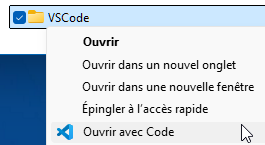
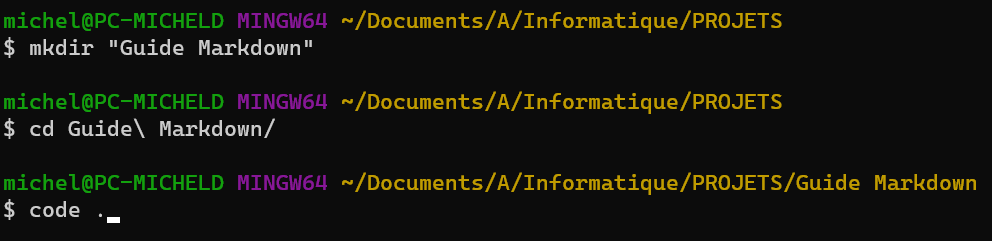
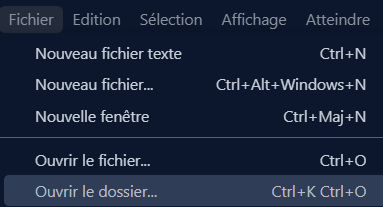
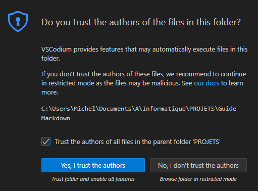
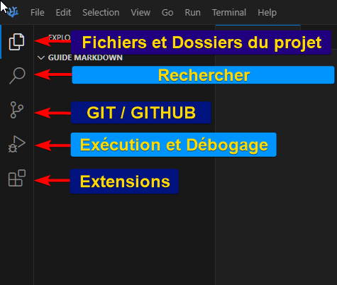
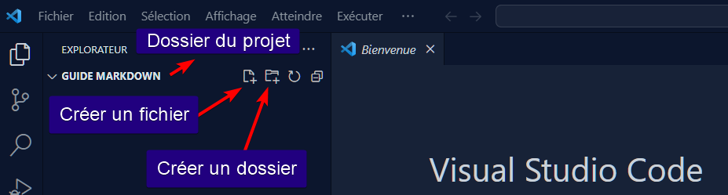
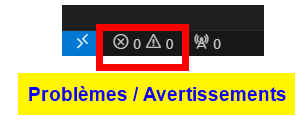
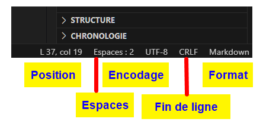
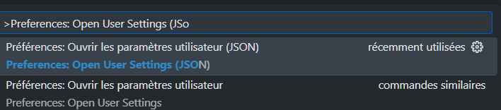

# Prise en mains Visual Studio Code

- [Prise en mains Visual Studio Code](#prise-en-mains-visual-studio-code)
  - [Créer et ouvrir un dossier](#créer-et-ouvrir-un-dossier)
    - [Avec clic droit](#avec-clic-droit)
    - [Interface en ligne de commande](#interface-en-ligne-de-commande)
    - [Interface graphique](#interface-graphique)
  - [Interface](#interface)
    - [Barre latérale](#barre-latérale)
    - [Dossier](#dossier)
    - [Barre d’état](#barre-détat)
  - [Raccourcis clavier](#raccourcis-clavier)
  - [Interface cli](#interface-cli)
  - [Extensions](#extensions)
  - [Configuration (`settings.json`)](#configuration-settingsjson)
    - [Configuration suggérée](#configuration-suggérée)
    - [Configurations complémentaires](#configurations-complémentaires)
  - [Ressources](#ressources)

## Créer et ouvrir un dossier

### Avec clic droit



### Interface en ligne de commande

Créer un dossier et écrire `code .` ou `codium .` pour ouvrir le dossier en cours



### Interface graphique



Faire confiance aux auteurs



## Interface

Cf. [Qu’est-ce que Visual Studio Code ?](https://learn.microsoft.com/fr-fr/training/modules/introduction-to-visual-studio-code/2-what-is-visual-studio-code)

### Barre latérale



### Dossier



### Barre d’état





## Raccourcis clavier

| Raccourci             | Commande                         |
|-----------------------|----------------------------------|
| **Généraux**          |                                  |
| `Ctrl Shift P`            | Palette de commandes             |
| `Ctrl Shift X`            | Extensions                       |
| `Ctrl ,`              | Paramètres                       |
| **Fichier**           |                                  |
| `Ctrl S`              | Sauvegarder le fichier           |
| `Ctrl Z`              | Annuler la dernière action       |
| `Ctrl Y`              | Refaire la dernière action       |
| `Alt Z`               | Retour automatique à la ligne    |
| `Ctrl G`              | Aller à la ligne                 |
| `Alt Shift f`             | Formater le code                 |
| `Ctrl T`              | Rechercher un symbole            |
| **Sélection colonne** |                                  |
| `Alt Click`           | Curseurs multiples               |
| `Shift Alt Click`         | Sélection verticale, par colonne |
| `Ctrl Shift Alt (flèche)`         | Sélection verticale, par colonne |
| **Commentaires**                 |                                          |
| `Alt Shift A`         | Commenter/Décommenter le bloc            |
| **Autres**                  |                                          |
| `Ctrl :`          | Commenter/Décommenter les lignes         |
| `Ctrl K` `Ctrl T` | Thème VS Code (suggestion : GitHub Blue) |
| `Ctrl ù`          | Afficher / masquer la fenêtre `TERMINAL` |
| **Tous** | |
| Commande | >Help: Keyboard Shortcuts Reference |
| Lien | [Windows](https://code.visualstudio.com/shortcuts/keyboard-shortcuts-windows.pdf) \| [Linux](https://code.visualstudio.com/shortcuts/keyboard-shortcuts-linux.pdf ) \|  [macOS](https://code.visualstudio.com/shortcuts/keyboard-shortcuts-macos.pdf) |

## Interface cli

- `code -h`, `code --help`
- `code -v`, `code --version`
- `code --wait`
- `code -g <file:line[:character]>`, `code --goto <file:line[:character]>`
- `code --list-extensions`
- `code --install-extension <ext-id>`
- `code --uninstall-extension <ext-id>`
- `code --disable-extensions .`

<!-- - Shell `cat extensions.txt | xargs -L 1 echo code --install-extension`
- Powershell `type extensions.txt | % { "code --install-extension $_" }` -->

## Extensions

- La liste des extensions à installer dépend du langage de programmation
- Chaque extension a des réglages
- Cf. [extensions.json](.vscode/extensions.json) pour une lsite de base
- Autres extensions : [Zipfs](https://marketplace.visualstudio.com/items?itemName=arcanis.vscode-zipfs), [vscode-open](https://marketplace.visualstudio.com/items?itemName=sandcastle.vscode-open), [Indent-Rainbow](https://marketplace.visualstudio.com/items?itemName=oderwat.indent-rainbow)
- Cf. la liste des réglates et extensions fournies par [VSC Essentials](https://marketplace.visualstudio.com/items?itemName=Gydunhn.vsc-essentials)

## Configuration (`settings.json`)

### Configuration suggérée

Dans la Palettede Commande `Ctrl Shift P` cherher  
     `>Preferences: Open User Settings (JSON)`



Voir le fichier [settings.json](.vscode/settings.json)

### Configurations complémentaires

```json
{
  "editor.detectIndentation": false,
  "editor.fontLigatures": false,
  // "editor.unicodeHighlight.ambiguousCharacters": true,
  // "editor.unicodeHighlight.invisibleCharacters": true,
  "editor.unicodeHighlight.nonBasicASCII": true,
  "editor.unicodeHighlight.allowedCharacters": {
    "é": true,
    "è": true,
    "ê": true
  },
  "indentRainbow.indicatorStyle": "light",
  "indentRainbow.colors": [
    "rgba(255,255,64,0.5)",
    "rgba(127,255,127,0.5)",
    "rgba(255,127,255,0.5)",
    "rgba(79,236,236,0.5)"
  ],
  "workbench.colorTheme": "GitHub Blue",
  // "workbench.editorAssociations": {
  //   "*.png": "imagePreview.previewEditor"
  // },
  "workbench.editor.showIcons": true,
  "workbench.iconTheme": "vscode-icons",
  "workbench.settings.editor": "json",
}
```

## Ressources

- <https://code.visualstudio.com/docs/getstarted/getting-started>
- <https://code.visualstudio.com/docs/getstarted/tips-and-tricks>
- <https://learn.microsoft.com/fr-fr/training/modules/introduction-to-visual-studio-code/>
- [Top 10 VSCode Settings](https://dev.to/bhagatparwinder/top-10-vs-code-settings-1bkm)
